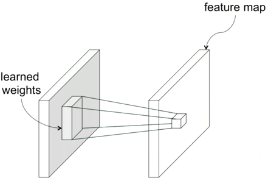
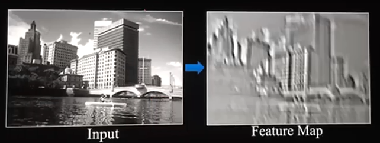
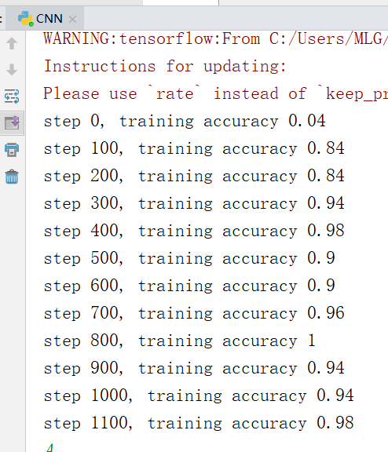

# 2 卷积神经网络
- [1.1算法介绍](#11----)
- [1.2实验代码](#12----)
- [1.3实验结果](#13----)
- [1.4实验总结](#14----)
## 2.1算法介绍

卷积神经网络（Convolutional Neural Network, CNN）是一种前馈神经网络，它的人工神经元可以响应一部分覆盖范围内的周围单元，对于大型图像处理有出色表现。卷积神经网络由一个或多个卷积层和顶端的全连通层（对应经典的神经网络）组成，同时也包括关联权重和池化层（pooling layer）。这一结构使得卷积神经网络能够利用输入数据的二维结构。

卷积神经网络中比较重要的一个概念是卷积操作，如下图所示，根据learned weights将若干块映射到一个新的矩阵上。



其实卷积操作并不陌生，在日常生活中p图时就经常会用到，例如对图片的锐化、模糊等操作，就是用一个特定的矩阵（图中的learned weights矩阵）对原图像进行卷积操作。下图就是一张图片卷积后的样子。



不难看出卷积操作后图片会变小，经过若干次的操作（相当于隐藏层），最后输出一个和上面介绍BP神经网络时一样的具有10个元素的向量，分别代表是某个数字的概率。如下图


不断优化中间参数的值，利用梯度下降或其他优化方法，就可以完成模型的训练。

## 2.2实验代码

```python
#下载、导入数据用到的函数包
import input_data
#读取数据
mnist = input_data.read_data_sets('MNIST_data', one_hot=True)
#tensorflow 2.x没有placeholder所以要用1.x的API
import tensorflow.compat.v1 as tf
tf.disable_v2_behavior()

sess = tf.InteractiveSession()
# 我们在TensorFlow运行计算时输入这个值。我们希望能够输入任意数量的MNIST图像，每一张图展平成784维的向量。
x = tf.placeholder("float", shape=[None, 784])
#为了计算交叉熵，我们首先需要添加一个新的占位符用于输入正确值
y_ = tf.placeholder("float", shape=[None, 10])
#W的维度是[784，10]，因为我们想要用784维的图片向量乘以它以得到一个10维的证据值向量
W = tf.Variable(tf.zeros([784,10]))
#b的形状是[10]，所以我们可以直接把它加到输出上面
b = tf.Variable(tf.zeros([10]))
#初始化
sess.run(tf.initialize_all_variables())
#计算每个分类的softmax概率值
y = tf.nn.softmax(tf.matmul(x,W) + b)
#损失函数是目标类别和预测类别之间的交叉熵。
cross_entropy = -tf.reduce_sum(y_*tf.log(y))
#用最速下降法让交叉熵下降，步长为0.01
train_step = tf.train.GradientDescentOptimizer(0.01).minimize(cross_entropy)

#整个模型的训练可以通过反复地运行train_step来完成
for i in range(1000):
  batch = mnist.train.next_batch(50)
  train_step.run(feed_dict={x: batch[0], y_: batch[1]})

#评估模型
correct_prediction = tf.equal(tf.argmax(y,1), tf.argmax(y_,1))
accuracy = tf.reduce_mean(tf.cast(correct_prediction, "float"))
print (accuracy.eval(feed_dict={x: mnist.test.images, y_: mnist.test.labels}))

#上面的代码是应用BP神经网络
#下面将构建一个多层卷积网络

#权重初始化
def weight_variable(shape):
  initial = tf.truncated_normal(shape, stddev=0.1)
  return tf.Variable(initial)

def bias_variable(shape):
  initial = tf.constant(0.1, shape=shape)
  return tf.Variable(initial)

#卷积和池化
def conv2d(x, W):
  return tf.nn.conv2d(x, W, strides=[1, 1, 1, 1], padding='SAME')

def max_pool_2x2(x):
  return tf.nn.max_pool(x, ksize=[1, 2, 2, 1],
                        strides=[1, 2, 2, 1], padding='SAME')

#第一层卷积
W_conv1 = weight_variable([5, 5, 1, 32])
b_conv1 = bias_variable([32])

x_image = tf.reshape(x, [-1,28,28,1])

h_conv1 = tf.nn.relu(conv2d(x_image, W_conv1) + b_conv1)
h_pool1 = max_pool_2x2(h_conv1)

#第二层卷积
W_conv2 = weight_variable([5, 5, 32, 64])
b_conv2 = bias_variable([64])

h_conv2 = tf.nn.relu(conv2d(h_pool1, W_conv2) + b_conv2)
h_pool2 = max_pool_2x2(h_conv2)

#密集连接层
W_fc1 = weight_variable([7 * 7 * 64, 1024])
b_fc1 = bias_variable([1024])

h_pool2_flat = tf.reshape(h_pool2, [-1, 7*7*64])
h_fc1 = tf.nn.relu(tf.matmul(h_pool2_flat, W_fc1) + b_fc1)

#Dropout
keep_prob = tf.placeholder("float")
h_fc1_drop = tf.nn.dropout(h_fc1, keep_prob)

#输出层
W_fc2 = weight_variable([1024, 10])
b_fc2 = bias_variable([10])

y_conv=tf.nn.softmax(tf.matmul(h_fc1_drop, W_fc2) + b_fc2)

#训练和评估模型
cross_entropy = -tf.reduce_sum(y_*tf.log(y_conv))
train_step = tf.train.AdamOptimizer(1e-4).minimize(cross_entropy)
correct_prediction = tf.equal(tf.argmax(y_conv,1), tf.argmax(y_,1))
accuracy = tf.reduce_mean(tf.cast(correct_prediction, "float"))
sess.run(tf.initialize_all_variables())
for i in range(20000):
  batch = mnist.train.next_batch(50)
  if i%100 == 0:
    train_accuracy = accuracy.eval(feed_dict={
        x:batch[0], y_: batch[1], keep_prob: 1.0})
    print ("step %d, training accuracy %g"%(i, train_accuracy))
  train_step.run(feed_dict={x: batch[0], y_: batch[1], keep_prob: 0.5})

print ("test accuracy %g"%accuracy.eval(feed_dict={
    x: mnist.test.images, y_: mnist.test.labels, keep_prob: 1.0}))
```

## 2.3实验结果

可以看出使用卷积神经网络训练的准确率要比BP神经网络高。



## 2.4实验总结

1、我们看到一个的东西时，其实眼睛并没有注意到整个物体，而是把注意力集中在一小部分。比如说我们看到一个人时，首先注意到的是他的脸。卷积操作就相当于提取图片的特征信息，相当于将计算机的注意力放在图片的某一部分。我们将中间的隐藏层作为图片输出时，看到的东西会很奇怪，虽然我们看不懂，但这些相当于计算机对这张图片的一种抽象认识。

2、完成本篇实验报告后对卷积神经网络有了初步的认识。但对其中的激励层、池化层等概念还没有深入彻底的理解，只是模糊的知道大概是干什么的，对深度学习中的数学原理也没有很透彻的理解，还需要今后不断地学习。