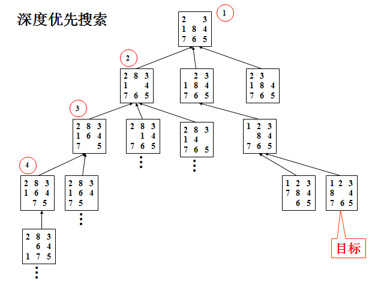
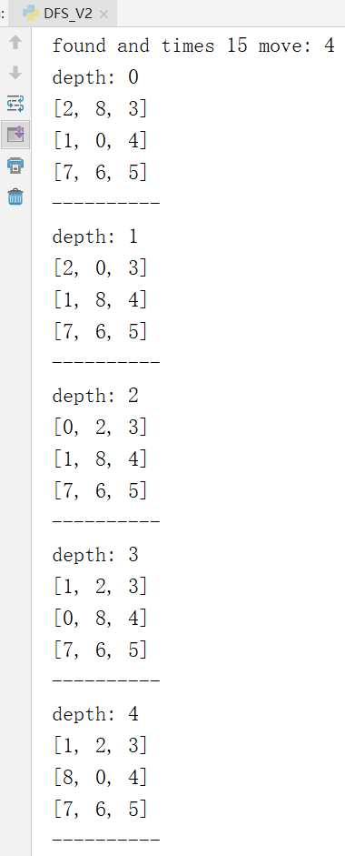
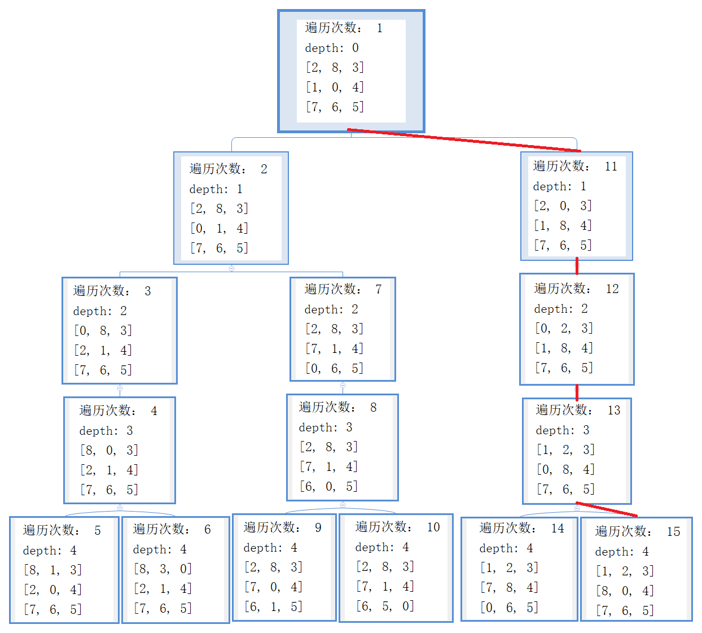

# 1 深度优先遍历搜索(DFS)
- [1.1算法介绍](#11算法介绍)
- [1.2实验代码](#12实验代码)
- [1.3实验结果](#13实验结果)
- [1.4实验总结](#14实验总结)
## 1.1算法介绍

深度优先搜索算法（Depth-First-Search，DFS）是一种用于遍历或搜索树或图的算法。沿着树的深度遍历树的节点，尽可能深的搜索树的分支。当节点v的所在边都己被探寻过，搜索将回溯到发现节点v的那条边的起始节点。这一过程一直进行到已发现从源节点可达的所有节点为止。如果还存在未被发现的节点，则选择其中一个作为源节点并重复以上过程，整个进程反复进行直到所有节点都被访问为止。属于盲目搜索。


以上图为例，简述DFS的过程。首先从根节点“1”出发，按一定的顺序遍历其子节点，这里我们假设优先遍历左边的。所以，在遍历“1”之后，我们到了节点“2”，此时“2”仍有子节点，所以应继续向下遍历，下一个节点是“3”，然后是“4”。到了“4”之后，没有子节点了，说明我们已经将这一条路遍历完了，接着我们应该回溯，应该回到“4”的父节点，也就是“3”。因为“3”还有一个子节点“5”没有遍历，所以下一个我们应该遍历的是“5”。遍历完“5”之后又发现一条路到头了，再次回溯依然回溯到其父节点“3”，此时“3”的所有子节点都已经遍历完了，因该接着回溯到“3”的父节点“2”，然后检查“2”是否有没有遍历完的子节点。按照这样的规则，完成所有节点的遍历。最终得到的遍历顺序是“1-2-3-4-5-6-7-8-9-10-11-12”

 

在介绍了DFS在遍历树的应用后，我们将其应用于八数码问题的解决。八数码问题也称为九宫问题。在3×3的棋盘，摆有八个棋子，每个棋子上标有1至8的某一数字，不同棋子上标的数字不相同。棋盘上还有一个空格，与空格相邻的棋子可以移到空格中。要求解决的问题是：给出一个初始状态和一个目标状态，找出一种从初始转变成目标状态的移动棋子步数最少的移动步骤。所谓问题的一个状态就是棋子在棋盘上的一种摆法。棋子移动后，状态就会发生改变。解八数码问题实际上就是找出从初始状态到达目标状态所经过的一系列中间过渡状态。

上面说的DFS遍历的树是已经存在的，我们只需要按照规定的遍历方法就能完成遍历，而对于八数码问题，没有已经存在的路径供我们遍历，需要我们从初始状态向下延伸（也就是上下左右移动）才能构造出类似的树。



以上图为例。在使用DFS进行搜索时，每个状态都会按照一定的顺序进行上下左右移动（在上图中是下、左、右、上的顺序），一次移动后会产生一个新的状态，然后以新状态为起点继续按约定的顺序（例如先向下）移动。终止的条件是找到解或者达到深度界限。那么如果按照图中下、左、右、上的顺序搜索后的结果将会是最左边的一条路一直是优先向下移动，如果不能向下则依次会是左、右、上的一种。

## 1.2实验代码

```python
import copy
#棋盘的类，实现移动和扩展状态
class grid:
    def __init__(self, stat):
        self.pre = None
        self.target = [[1, 2, 3], [8, 0, 4], [7, 6, 5]]
        self.stat = stat
        self.find0()
        self.update()
    #更新深度和距离和
    def update(self):
        self.fH()
        self.fG()

    # G是深度，也就是走的步数
    def fG(self):
        if (self.pre != None):
            self.G = self.pre.G + 1
        else:
            self.G = 0

    # H是和目标状态距离之和，可以用来判断是否找到解
    def fH(self):

        self.H = 0
        for i in range(3):
            for j in range(3):
                targetX = self.target[i][j]
                nowP = self.findx(targetX)
                self.H += abs(nowP[0] - i) + abs(nowP[1] - j)

    #以三行三列的形式输出当前状态
    def see(self):
        print("depth:", self.G)
        for i in range(3):
            print(self.stat[i])
        print("-" * 10)

    # 查看找到的解是如何从头移动的
    def seeAns(self):
        ans = []
        ans.append(self)
        p = self.pre
        while (p):
            ans.append(p)
            p = p.pre
        ans.reverse()
        for i in ans:
            i.see()
    #找到数字x的位置
    def findx(self, x):
        for i in range(3):
            if (x in self.stat[i]):
                j = self.stat[i].index(x)
                return [i, j]
    #找到0的位置，也就是空白格的位置
    def find0(self):
        self.zero = self.findx(0)

    #对当前状态进行扩展，也就是上下左右移动，返回的列表中是状态的二维列表，不是对象
    def expand(self):
        i = self.zero[0]
        j = self.zero[1]
        gridList = []
        if (j == 2 or j == 1):
            gridList.append(self.left())
        if (i == 2 or i == 1):
            gridList.append(self.up())
        if (i == 0 or i == 1):
            gridList.append(self.down())
        if (j == 0 or j == 1):
            gridList.append(self.right())
        return gridList

    # deepcopy多维列表的复制，防止指针赋值将原列表改变
    # move只能移动行或列，即row和col必有一个为0
    #对当前状态进行移动的函数
    def move(self, row, col):
        newStat = copy.deepcopy(self.stat)
        tmp = self.stat[self.zero[0] + row][self.zero[1] + col]
        newStat[self.zero[0]][self.zero[1]] = tmp
        newStat[self.zero[0] + row][self.zero[1] + col] = 0
        return newStat

    def up(self):
        return self.move(-1, 0)

    def down(self):
        return self.move(1, 0)

    def left(self):
        return self.move(0, -1)

    def right(self):
        return self.move(0, 1)

# 判断状态g是否在状态集合中，g是对象，gList是对象列表
#返回的结果是一个列表，第一个值是真假，如果是真则第二个值是g在gList中的位置索引
def isin(g, gList):
    gstat = g.stat
    statList = []
    for i in gList:
        statList.append(i.stat)
    if (gstat in statList):
        res = [True, statList.index(gstat)]
    else:
        res = [False, 0]
    return res

#计算逆序数之和
def N(nums):
    N=0
    for i in range(len(nums)):
        if(nums[i]!=0):
            for j in range(i):
                if(nums[j]>nums[i]):
                    N+=1
    return N

#根据逆序数之和判断所给八数码是否可解
def judge(src,target):
    N1=N(src)
    N2=N(target)
    if(N1%2==N2%2):
        return True
    else:
        return False

#初始状态
startStat = [[2, 8, 3], [1, 0, 4], [7, 6, 5]]
g = grid(startStat)
#判断所给的八数码受否有解
if(judge(startStat,g.target)!=True):
    print("所给八数码无解，请检查输入")
    exit(1)
#visited储存的是已经扩展过的节点
visited = []
time = 0
#用递归的方式进行DFS遍历
def DFSUtil(v, visited):
    global time
    #判断是否达到深度界限
    if (v.G > 4):
        return
    time+=1
    #判断是否已经找到解
    if (v.H == 0):
        print("found and times", time, "moves:", v.G)
        v.seeAns()
        exit(1)

    #对当前节点进行扩展
    visited.append(v.stat)
    expandStats = v.expand()
    w = []
    for stat in expandStats:
        tmpG = grid(stat)
        tmpG.pre = v
        tmpG.update()
        if (stat not in visited):
            w.append(tmpG)
    for vadj in w:
        DFSUtil(vadj, visited)
    #visited查重只对一条路，不是全局的，每条路开始时都为空
    #因为如果全局查重，会导致例如某条路在第100层找到的状态，在另一条路是第2层找到也会被当做重复
    #进而导致明明可能会找到解的路被放弃
    visited.pop()

DFSUtil(g, visited)
#如果找到解程序会在中途退出，走到下面这一步证明没有找到解
print("在当前深度下没有找到解，请尝试增加搜索深度")
```

## 1.3实验结果

以下面这个八数码为例，用DFS进行搜索。


将找出的解从初始状态一步一步输出到解状态。



可以看出总共进行了15次遍历，在某一条路的第4层找到了解。

下面我们来看一看DFS的所有15次遍历，以此来更深入的理解DFS的原理。稍微对代码进行改动，使其输出遍历次数和当前层数。由于结果太长，为了方便展示，下面将以树的形式展示。



上面输出的解就是按照红色路线标注找到的，从遍历次数可以看出DFS是一条道走到黑的找法，因为设置的深度界限是4，所以每一条路最多找到第4层。

## 1.4实验总结

1、为什么要设置深度界限？

因为理论上我们只需要一条路就可以找到解，只要不停地向下扩展就可以了。而这样做的缺点是会绕远路，也许第一条路找到第100层才找到解，但第二条路找两层就能找到解。从DFS的原理出发，我们不难看出这一点。还有一个问题是其状态数太多了，在不设置深度界限的情况下经常出现即使程序的栈满了依然没有找到解的情况。所以理论只是理论，在坚持“一条道走到黑”时，很可能因为程序“爆栈”而走到了黑还是没有找到解。

2、如何进行回溯？

在八数码问题中，我们回溯的条件只有一个，就是达到深度界限了。因为在找到解时会退出，找不到时会继续向下扩展。回溯的过程是先回溯到父节点，检查父节点是否还能扩展其他节点，如果能，就扩展新的节点并继续向下搜索，如果不能则递归地继续向上回溯。

3、出现重复状态怎么解决？

不难想出假如按照下、左、右、上这样地顺序进行搜索时，在第三层时就会出现和初始状态相同的情况。因为第二层向一个方向移动，第三层会有一个向反方向移动的状态也就是回到初始状态了。这样不仅增加了运算量，而且没有意义，会出现很多冗余步骤。所以我们应该设置一个查重的表，将已经遍历过的状态存入这个表中，当再次遇到这种情况时我们就跳过。

那么这个查重的表是该对于全局而言呢，还是每条路的查重表是独立的呢？在经过很多测试之后，我发现这个查重表对每条路独立是更好的。因为在一条路上出现的状态所需要的步数和另一条需要的步数不一定相同，也就是说我在第一条路上的第100层找到了某个状态，放入了查重表中，但是这个状态可能在另一条路上第2层就能找到，或许再下面几层就能找到解了，可是由于被放进了全局查重表中而放弃了这个条路的扩展，也损失了更快找到解的机会。所以一条路一个查重表是好的。

4、由于需要设置深度界限，每条路都会在深度界限处截至， 而如果所给的八数码的最优解大于深度界限，就会出现遍历完所有情况都找不解。而在事先不知道最优解的深度的情况下这个深度界限很难确定，设置大了会增大搜索时间，设置小了会找不到解。这也是DFS的一个缺点。

5、DFS不一定能找到最优解。因为深度界限的原因，找到的解可能在最优解和深度界限之间。